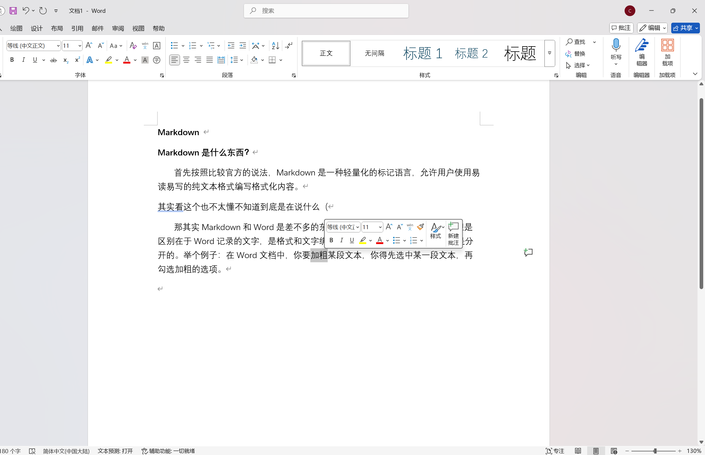
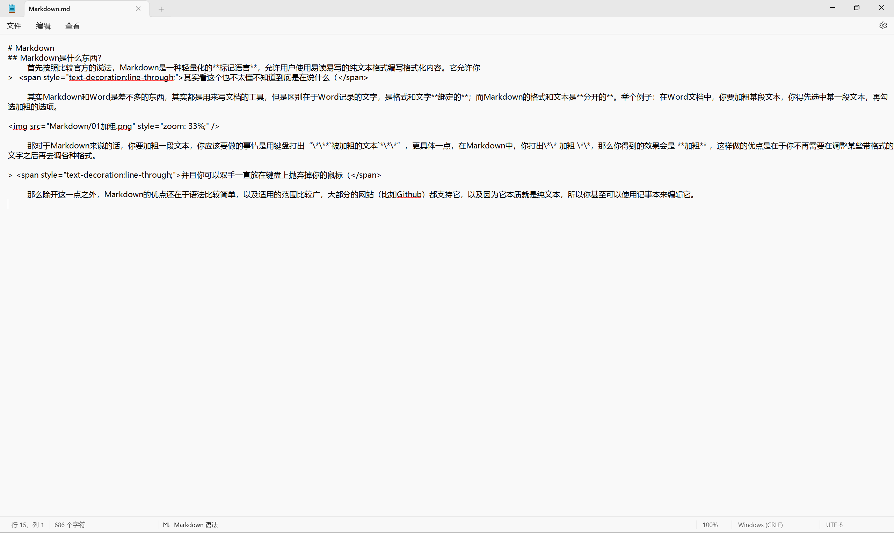

# Markdown 

## Markdown是什么东西？

​	首先按照比较官方的说法，Markdown是一种轻量化的**标记语言**，允许用户使用易读易写的纯文本格式编写格式化内容。它允许你
 > <span style="text-decoration:line-through;">其实看这个也不太懂不知道到底是在说什么（</span>

​	其实Markdown和Word是差不多的东西，其实都是用来写文档的工具，但是区别在于Word记录的文字，是格式和文字**绑定的**；而Markdown的格式和文本是**分开的**。举个例子：在Word文档中，你要加粗某段文本，你得先选中某一段文本，再勾选加粗的选项。



​	那对于Markdown来说的话，要加粗一段文本，要做的事情是打出“\*\**`被加粗的文本`*\*\*”，更具体一点，在Markdown中，打出\*\* 加粗 \*\*，得到的效果会是 **加粗** ，这样做的优点是在于不再需要在调整某些带格式的文字之后再去调各种格式。

> <span style="text-decoration:line-through;">并且你可以双手一直放在键盘上抛弃掉你的鼠标（</span>

​	那么除开这一点之外，Markdown的优点还在于语法比较简单，以及适用的范围比较广，大部分的网站（比如Github）都支持它，你甚至可以使用记事本来编辑它。

> 顺带一提，这个网页的文本文件也是用Markdown写的



<center>这是用记事本打开的md.文件（md.即markdown对应的文件格式）</center>


<center>这是用记事本打开的docs.文件，可以看到是一段乱码</center>


>然后是一个小插曲，实际上我们在使用AI的时候，它输出的其实也是Markdown格式的文本，所以说在AI还在输出的时候我们会看到一堆“\*\*”之类的东西

​	除此之外，在Markdown中，输入各种公式也更加方便一些，但是确实涉及到的东西比较多，所以就放一个网页在这里，可能用着用着就熟悉了（Markdown的数学公式的格式和Latex是一样的）。

> [在线LaTeX公式编辑器-编辑器](https://www.latexlive.com/##)

​	然后是Markdown的官方的格式教程的网址：

> [Markdown 基本语法 | Markdown 教程](https://markdown.com.cn/basic-syntax/)

​	然后我也把日常会用得比较多的Markdown的格式写在下边。

## Markdown 常用格式

---

### 1.标题

​	在Markdown中，我们想要表示标题，需要使用到的标识符号是\#

```text
# 一级标题
## 二级标题
### 三级标题
#### 四级标题
......
###### 六级标题
```

---

​	对应的效果如下：

# 一级标题

## 二级标题

### 三级标题

#### 四级标题

......

###### 六级标题

---

​	需要注意的是，在一些Markdown编辑器中输入\#之后需要加上空格，才能够正确识别标题，然后在Markdown中，输入的标题将会被自动地加入到文件大纲之中。

---

## 2.修改文字样式

​	在Markdown中，修改文字的样式，如加粗等，对应的格式如下：

```
**粗体文本** 或  __粗体文本__
*斜体文本* 或 _斜体文本_
***粗斜体文本***
~~删除线文本~~
==高亮文本==
```

---

​	对应的效果如下：

**粗体文本** 或  **粗体文本__
*斜体文本* 或 *斜体文本_
***粗斜体文本***
<s>删除线文本</s>
<mark>高亮文本</mark>

---

## 3.列表

​	在
