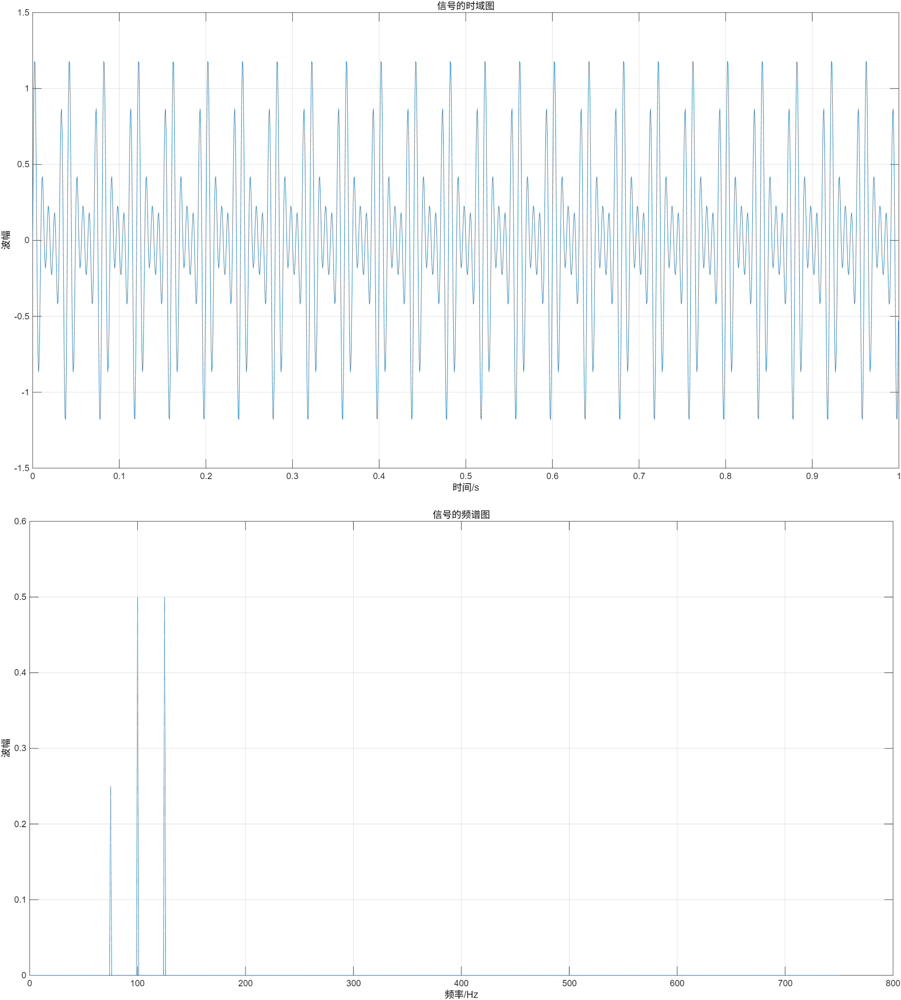
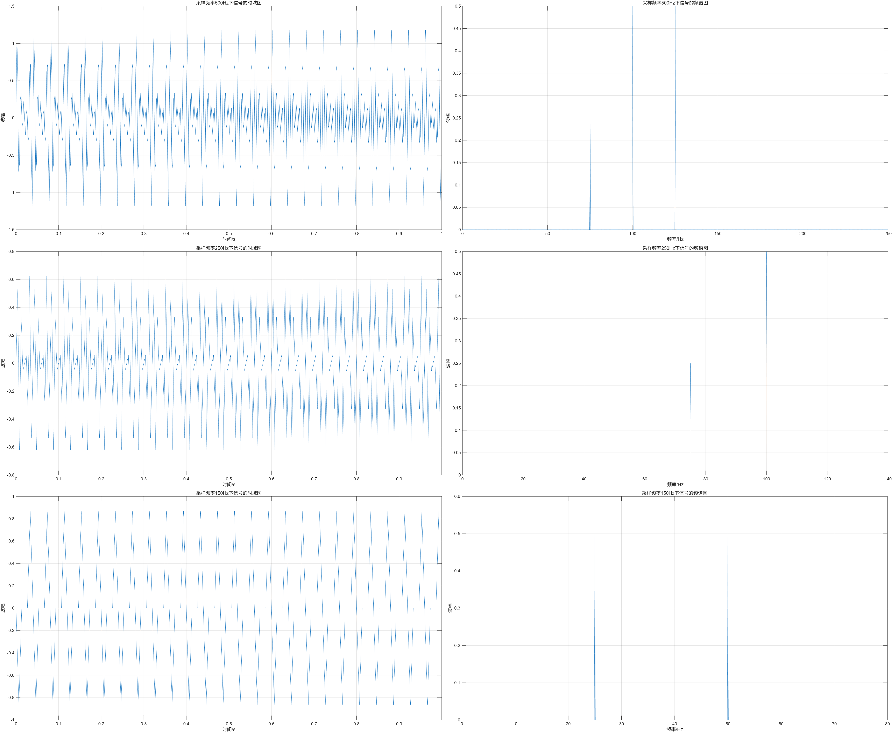
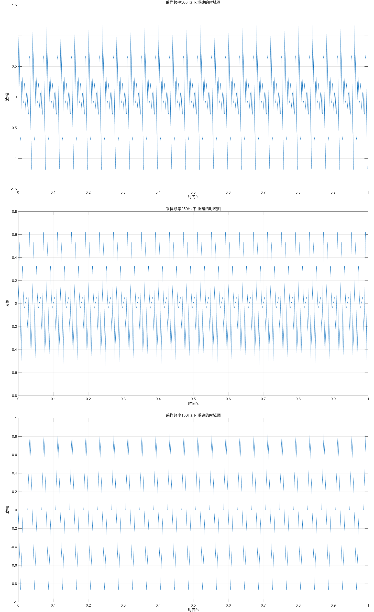
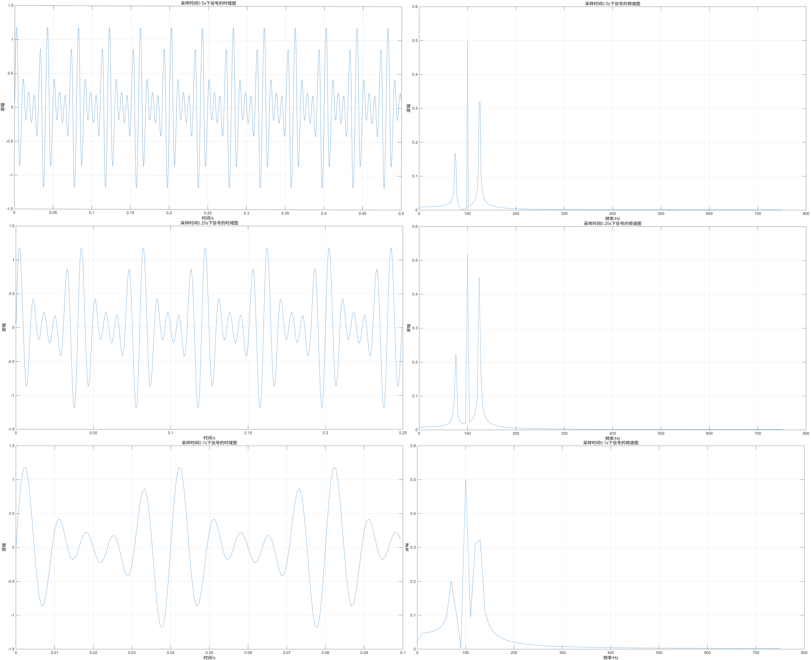
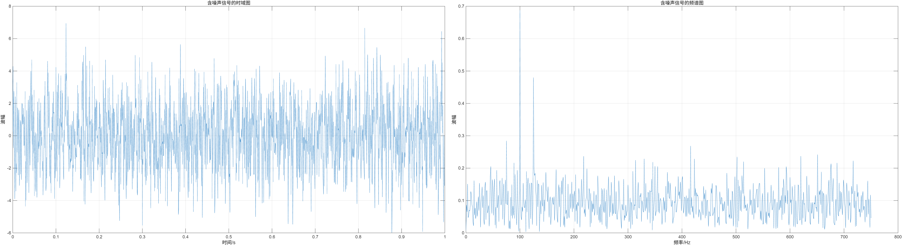
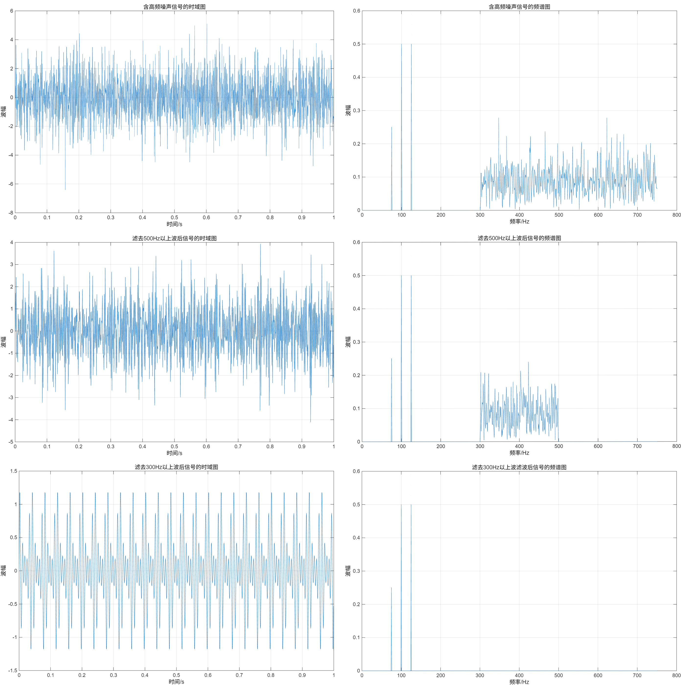

# 信号频谱分析

## **1** **实验目的和要求**

### **1.1** **实验目的**

**（1）** 初步学习 MATLAB 的使用方法，熟悉利用 MATLAB 对信号进行简单的分析处理操作；

**（2）** 学会使用 FFT 函数和 IFFT 函数进行时域和频域之间的转换；

**（3）** 加深对奈奎斯特采样定理、时域和频域的概念的认识.

### **1.2** **实验要求**

（1）构建一个信号，要求至少含有三个频率分量；

（2）利用 MATLAB 分析器频谱，并且进行适当处理；

（3）观察过程中频谱图和时域图的变化.

## **2** **实验原理**

### **2.1 傅里叶变换**

​    任何周期信号都可以通过傅里叶变换被分解为直流和许多余弦分量，通过傅里叶级数形式对信号的表示，能够得到信号的频谱描述形式；对于非周期信号，其可悲看成是周期无限大的周期信号，其频谱是连续的.

  在实际采样过程中，在数字信号处理中，常对离散时域信号进行分析，采用离散傅里叶变换（$DFT$）  及其快速算法（$FFT$） .

对于长度为  的离散时域序列  ，其离散傅里叶变换（$DFT$）定义为：

$$ X(k)=\sum_{n=0}^{N-1}x(n)e^{-j\frac{2\pi}{N}kn} \quad (k=0,1,\dots,N-1)$$

对应的逆离散傅里叶变换（）可将域信号还原为时域信号，定义为：

 $$x(n)=\frac{1}{N}\sum_{k=0}^{N-1}X(k)e^{j\frac{2\pi}{N}kn} \quad (n=0,1,\dots,N-1)$$

   $x(n)$：离散时域信号， 

   $X(k)$：离散频域信号，反映信号不同频率分量的幅值和相位特性；

   $k$：频率索引，其对应的实际频率计算公式为 $f_k=\frac{kF_s}{N}$ ， $F_s$ 为采样频率；

   $j$：虚数单位，满足 $j^2=-1$；

  ：离散信号的采样点数.

对采样得到的离散信号进行  变换后，需要通过修正幅值（因 $DFT$ 频谱具有共轭对称性，正频率分量幅值需乘以 2 以对应原始时域信号实际幅值），最终得到清晰的频谱图，用于分析信号的频率组成及滤波效果.

### **2.2** **奈奎斯特采样定律**

​    当时间信号的最高频率分量为 $f_{max}$ 时，采样的最低频率 $f_N$ 应该大于或等于 $2f_{max}$，否则采样后信号的频率就会发生重叠，高于采样频率一半的频率成分将会被重建为低于采样频率一半的信号，采样数据中会出现虚假的低频成分.

## 3 **实验内容**

**3.1 构建信号**

​    由公式
$$
f(t)=\frac{1}{2}sin(250\pi t)+\frac{1}{2}sin(200\pi t)+\frac{1}{4}sin(150\pi t)
$$


​    构建一个信号.

  然后以采样频率为 1500Hz，采样时间为 1s 进行采样，然后对其进行 $FFT$ 后生成其频谱图，在之后的实验中，采用该信号为原信号.

**3.2 采样频率对信号频谱的影响**

​    对原信号，采用不同的采样频率，保持采样时间为 1s 不变，观察其时域图和频谱图的变化。在该实验中，分别改变采样频率为 500Hz、250Hz 和 150Hz，然后实施 $FFT$ 变换后观察其频谱图，接着再实施 $IFFT$，重建其时域图, 研究采样频率对信号图像的影响.

**3.3 采样时间对信号频谱的影响**

​    对原信号，保持采样频率为 1500Hz 不变，分别改变采样时间为 0.5s,0.25s 和 0.1s, 构建不同采样时间下的时域图和频谱图，研究采样频率对信号频谱的影响.

**3.4 添加时域随机噪声**

​    在原信号的基础上，添加一个均值为 0，方差为 4 的随机噪声信号，得到带噪声的信号，然后再构建该信号的时域图和频谱图.研究随机噪声对信号图像的影响.

**3.5 添加高频噪声，然后对信号进行滤波操作**

​    在原信号的基础上，添加一个只存在于 300Hz 以上的频段的噪声，构建该信号的时域图和频谱图.然后再对添加噪声后的信号进行滤波操作，滤去其带噪声的高频部分，再构建滤波后信号的时域图和频谱图, 对比进行滤波操作前后的信号图像.

## **4** **实验结果和分析**

**4.1 实验一：构建原始信号，对其进行采样，构建其频谱图和时域图**

​    采样频率为 1500Hz，采样时间为 1s，对信号 $f(t)$ 进行采样，使用 MATLAB 构建得到的时域图和频谱图如下图：



​	观察到采样后的时域图是周期性的图像，与预期符合：三个正弦波合成为了一个周期性的信号.观察时域图，看到通过离散傅里叶变换，离散的时域信号转化为了频域信号；在频谱图中有三个分立的“尖峰”，分别对应于原信号中的 125Hz、100Hz 和 75Hz 的正弦波分量，峰的高度对应于每个正弦波的波幅.

  可见相比时域图，频谱图能够更加清晰的显示信号中各个正弦波分量的频率和波幅信息.

**4.2 实验二：采样频率对信号的影响**

​    在原信号的基础上，分别改变采样频率为 500Hz、250Hz 和 150Hz，保持采样时间不变，得到采样信号的时域图和频谱图如下图所示：

​	由图可知，在采样时间保持不变的情况下，采样频率越高，时域图越能够反映信号的真实情况，采样效果越好.

  注意到当采样频率为奈奎斯特采样定律所指出的极限值 $2f_{max}=250Hz$ 时，尽管时域图反映原信号的效果尚可，但是采样得到的频谱图只得到了两个尖峰，丢失了 50Hz 的部分，这说明了尽管奈奎斯特采样定理指出的极限值在实际应用过程中是可能存在问题的，在实际采样过程中应该留出冗余量以避免出现较大的误差.

   当采样频率低于极限值时，采样的时域图和频谱图都不能够反映原信号的真实情况，在频谱图中丢失了原本的高频信号，出现了原本不存在的低频信号.

  再使用 MATLAB 对其进行 IFFT 变换，重建其时域图：

观察由采样结果重建的时域图，注意到在图一中，采样频率高于 $2f_{max}=250Hz$，所得到的时域图与原信号的图像比较吻合，在图三中，采样频率低于 $2f_{max}=250Hz$，所得到的时域图与原信号的图像差别较大，由此可以验证奈奎斯特采样定理.

**4.3 实验三：采样时间对信号的影响**

​    保持采样频率为 1500Hz 不变，分别改变采样时间为 0.5s,0.25s 和 0.1s，构建所得采样信号的时域图和频谱图如下图所示：

​	注意到当采样时间较长时，所得到的频谱图各个频段之间越分立，所得频谱图越精确；当采样时间较短时，在频谱图中会出现频谱之间的混叠，所得的频谱图会失真.

**4.4 实验四：添加噪声干扰**

​    在原信号的基础上，添加一个均值为 0，方差为 4 的随机噪声信号，构建这个带噪声的信号的时域图和频谱图如下图所示：

​	注意到在添加噪声信号之后，信号的时域图变得非常杂乱，从其中很难看出原信号的情况；在频谱图中，幅度较大的原信号图像（$100Hz$ 和 $125Hz$ 的部分）仍能够被从噪声中识别出来.

由此可以看出与时域相比，频域表示能够更好地反映出原信号的情况.

**4.5 实验五：添加高频噪声，进行滤波操作**

​    在原信号的基础上，添加一个只存在于添加一个只存在于 300Hz 以上的频段的噪声，然后对添加噪声后的信号进行滤波操作，分别滤去 500Hz 以上和 300Hz 的高频部分，滤波处理前后的信号的时域图和频谱图如下图所示：

​	从中可以看出在在添加了高频噪声之后，信号的时域图变得非常杂乱，在频域图中，原信号的图像与噪声信号明显地分开；进行滤波操作之后，所得信号明显地与原信号非常接近.

​	由此可以看出通过合理的信号处理，能够降低噪声对信号的影响；在频域下对信号进行分析，更有利于对信号的处理.

## **5** **实验结论**

本实验的结论如下：

- 对信号采样后可以从时域和频域两个角度对信号进行分析，相比之下，频谱图能够更加清晰的显示信号中各个正弦波分量的频率和波幅信息.从频域的角度对信号进行分析，更有利于信号的处理；

- 在 MATLAB 中，通过 FFT 和 IFFT 变换能够实现时域图和频谱图之间的转换；

- 信号的采样频率越高，采样时间越长，采样结果越贴近于真实情况；当采样频率低于信号的正弦信号分量中的最大频率两倍时，采样结果将不能够反映真实情况，将不能够从采样结果中重构出原信号，同时在频谱图中出现原本不存在的低频信号，丢失掉原本的高频信号；当采样时间过短时，将会在频谱图中出现波形的混叠现象，信号会失真.

- 当有信号干扰时，信号将会失真，观察信号的频谱图，能够观察出原信号的部分信息.

- 对有干扰的信号进行合适的滤波操作，能够降低噪声的影响.

## **6** **源代码与分析**

### 实验一、构建一个信号，并分析其频谱图和时域图

```matlab
%实验一
Fs = 1500;	%确定采样频率为1500Hz
T = 1/Fs;	
N = 1500;	
t = (0:N-1)*T;
Signal_origin = 0.5*sin(2*pi*125*t)+0.5*sin(2*pi*100*t)+0.25*sin(2*pi*75*t);	%生成信号
figure(1);
plot(t(1:1500),Signal_origin(1:1500));
xlabel('时间/s');
ylabel('波幅');
title('信号的时域图');
grid on;	%生成图表

Z = fft(Signal_origin);	%对信号进行FFT变换
P2 = abs(Z/N);	%取频率为正
P1 = P2(1:N/2+1);
P1(2:end-1) = 2*P1(2:end-1);	%由于频谱对称，只取一半
f = Fs*(0:(N/2))/N;
figure(2);
plot(f,P1);
xlabel('频率/Hz');
ylabel('波幅');
title('信号的频谱图');
grid on;	%生成图表
```

### 实验二、不同采样频率下的采样结果

```matlab
%实验二
Fs = 500;	%确定采样频率为500Hz
T = 1/Fs;
N = 1500;
t = (0:N-1)*T;
Signal_origin = 0.5*sin(2*pi*125*t)+0.5*sin(2*pi*100*t)+0.25*sin(2*pi*75*t);
figure(3);
plot(t(1:500),Signal_origin(1:500));
xlabel('时间/s');
ylabel('波幅');
title('采样频率500Hz下信号的时域图');
grid on;	%生成图表

Z = fft(Signal_origin);
P2 = abs(Z/N);
P1 = P2(1:N/2+1);
P1(2:end-1) = 2*P1(2:end-1);
f = Fs*(0:(N/2))/N;
figure(4);
plot(f,P1);
xlabel('频率/Hz');
ylabel('波幅');
title('采样频率500Hz下信号的频谱图');
grid on;	%生成图表

R = real(ifft(Z));
figure(5);
plot(t(1:500),R(1:500));
xlabel('时间/s');
ylabel('波幅');
title('采样频率500Hz下,重建的时域图');
grid on;	%生成图表

Fs = 250;
T = 1/Fs;
N = 1500;
t = (0:N-1)*T;
Signal_origin = 0.5*sin(2*pi*125*t)+0.5*sin(2*pi*100*t)+0.25*sin(2*pi*75*t);
figure(6);
plot(t(1:250),Signal_origin(1:250));
xlabel('时间/s');
ylabel('波幅');
title('采样频率250Hz下信号的时域图');
grid on;	%生成图表

Z = fft(Signal_origin);
P2 = abs(Z/N);
P1 = P2(1:N/2+1);
P1(2:end-1) = 2*P1(2:end-1);
f =Fs*(0:(N/2))/N;
figure(7);
plot(f,P1);
xlabel('频率/Hz');
ylabel('波幅');
title('采样频率250Hz下信号的频谱图');
grid on;	%生成图表

R = real(ifft(Z));
figure(8);
plot(t(1:250),R(1:250));
xlabel('时间/s');
ylabel('波幅');
title('采样频率250Hz下,重建的时域图');
grid on;	%生成图表

Fs = 150;
T = 1/Fs;
N = 1500;
t = (0:N-1)*T;
Signal_origin = 0.5*sin(2*pi*125*t)+0.5*sin(2*pi*100*t)+0.25*sin(2*pi*75*t);
figure(9);
plot(t(1:150),Signal_origin(1:150));
xlabel('时间/s');
ylabel('波幅');
title('采样频率150Hz下信号的时域图');
grid on;	%生成图表

Z = fft(Signal_origin);
P2 = abs(Z/N);
P1 = P2(1:N/2+1);
P1(2:end-1) = 2*P1(2:end-1);
f = Fs*(0:(N/2))/N;
figure(10);
plot(f,P1);
xlabel('频率/Hz');
ylabel('波幅');
title('采样频率150Hz下信号的频谱图');
grid on;	%生成图表

R = real(ifft(Z));
figure(11);
plot(t(1:150),R(1:150));
xlabel('时间/s');
ylabel('波幅');
title('采样频率150Hz下,重建的时域图');
grid on;	%生成图表

```

### 实验三、研究采样时间的影响

```matlab
%实验三
Fs = 1500;	%确定采样频率为1500Hz
T = 1/Fs;	
N = 750;	
t = (0:N-1)*T;
Signal_origin = 0.5*sin(2*pi*125*t)+0.5*sin(2*pi*100*t)+0.25*sin(2*pi*75*t);	%生成信号
figure(12);
plot(t(1:750),Signal_origin(1:750));
xlabel('时间/s');
ylabel('波幅');
title('采样时间0.5s下信号的时域图');
grid on;	%生成图表

Z = fft(Signal_origin);	
P2 = abs(Z/N);	%取频率为正
P1 = P2(1:N/2+1);
P1(2:end-1) = 2*P1(2:end-1);	%由于频谱对称，只取一半
f = Fs*(0:(N/2))/N;
figure(13);
plot(f,P1);
xlabel('频率/Hz');
ylabel('波幅');
title('采样时间0.5s下信号的频谱图');
grid on;	%生成图表

Fs = 1500;	%确定采样频率为1500Hz
T = 1/Fs;	
N = 375;	
t = (0:N-1)*T;
Signal_origin = 0.5*sin(2*pi*125*t)+0.5*sin(2*pi*100*t)+0.25*sin(2*pi*75*t);	%生成信号
figure(14);
plot(t(1:375),Signal_origin(1:375));
xlabel('时间/s');
ylabel('波幅');
title('采样时间0.25s下信号的时域图');
grid on;	%生成图表

Z = fft(Signal_origin);
P2 = abs(Z/N);	%取频率为正
P1 = P2(1:(N+1)/2+1);
P1(2:end-1) = 2*P1(2:end-1);	%由于频谱对称，只取一半
f = Fs*(0:((N+1)/2))/N;
figure(15);
plot(f,P1);
xlabel('频率/Hz');
ylabel('波幅');
title('采样时间0.25s下信号的频谱图');
grid on;	%生成图表

Fs = 1500;	%确定采样频率为1500Hz
T = 1/Fs;	
N = 150;	
t = (0:N-1)*T;
Signal_origin = 0.5*sin(2*pi*125*t)+0.5*sin(2*pi*100*t)+0.25*sin(2*pi*75*t);	%生成信号
figure(16);
plot(t(1:150),Signal_origin(1:150));
xlabel('时间/s');
ylabel('波幅');
title('采样时间0.1s下信号的时域图');
grid on;	%生成图表

Z = fft(Signal_origin);
P2 = abs(Z/N);	%取频率为正
P1 = P2(1:N/2+1);
P1(2:end-1) = 2*P1(2:end-1);	%由于频谱对称，只取一半
f = Fs*(0:(N/2))/N;
figure(17);
plot(f,P1);
xlabel('频率/Hz');
ylabel('波幅');
title('采样时间0.1s下信号的频谱图');
grid on;	%生成图表
```

### 实验四、添加噪声信号

```matlab
%实验四
Fs = 1500;	%确定采样频率为1500Hz
T = 1/Fs;
N = 1500;
t = (0:N-1)*T;
Signal_origin = 0.5*sin(2*pi*125*t)+0.5*sin(2*pi*100*t)+0.25*sin(2*pi*75*t);
Signal_Noise = Signal_origin + 2*randn(size(t));	%为原信号添加一个噪声信号
figure(18);
plot(t(1:1500),Signal_Noise(1:1500));
xlabel('时间/s');
ylabel('波幅');
title('含噪声信号的时域图');
grid on;	%生成图表

Z = fft(Signal_Noise);
P2 = abs(Z/N);
P1 = P2(1:N/2+1);
P1(2:end-1) = 2*P1(2:end-1);
f = Fs*(0:(N/2))/N;
figure(19);
plot(f,P1);
xlabel('频率/Hz');
ylabel('波幅');
title('含噪声信号的频谱图');
grid on;	%生成图表
```

### 实验五、添加高频噪声并进行滤波

```matlab
%实验五
Fs = 1500;		%确定采样频率为1500Hz
T = 1/Fs;
N = 1500;
t = (0:N-1)*T;
Signal_origin = 0.5*sin(2*pi*125*t)+0.5*sin(2*pi*100*t)+0.25*sin(2*pi*75*t);
X = fft(2*randn(size(t)));
X(1:301) = 0;
X(1200:1500) = 0;	%对噪声进行处理，去除掉其低于300Hz的部分
Noise_processed = real(ifft(X));	%取其实部，减小误差
Signal_Noise = Signal_origin + Noise_processed;
figure(20);
plot(t(1:1500),Signal_Noise(1:1500));
xlabel('时间/s');
ylabel('波幅');
title('含高频噪声信号的时域图');
grid on;	%生成图表

Z = fft(Signal_Noise);
P2 = abs(Z/N);
P1 = P2(1:N/2+1);
P1(2:end-1) = 2*P1(2:end-1);
f = Fs*(0:(N/2))/N;
figure(21);
plot(f,P1);
xlabel('频率/Hz');
ylabel('波幅');
title('含高频噪声信号的频谱图');
grid on;	%生成图表

Z(500:1000) = 0;	%去掉添加高频信号后，信号中高于500hz的部分
Signal_processed = real(ifft(Z));	%取其实部，减小误差
figure(22);
plot(t(1:1500),Signal_processed(1:1500));
xlabel('时间/s');
ylabel('波幅');
title('滤去500Hz以上波后信号的时域图');
grid on;	%生成图表

P2 = abs(Z/N);
P1 = P2(1:N/2+1);
P1(2:end-1) = 2*P1(2:end-1);
figure(23);
plot(f,P1);
xlabel('频率/Hz');
ylabel('波幅');
title('滤去500Hz以上波后信号的频谱图');
grid on;	%生成图表

H = fft(Signal_Noise);
H(300:1200) = 0;	%去掉添加高频信号后，信号中高于300hz的部分
Signal_processed = real(ifft(H));	%取其实部，减小误差
figure(24);
plot(t(1:1500),Signal_processed(1:1500));
xlabel('时间/s');
ylabel('波幅');
title('滤去300Hz以上波后信号的时域图');
grid on;	%生成图表

P2 = abs(H/N);
P1 = P2(1:N/2+1);
P1(2:end-1) = 2*P1(2:end-1);
figure(25);
plot(f,P1);
xlabel('频率/Hz');
ylabel('波幅');
title('滤去300Hz以上波滤波后信号的频谱图');
grid on;	%生成图表
```

