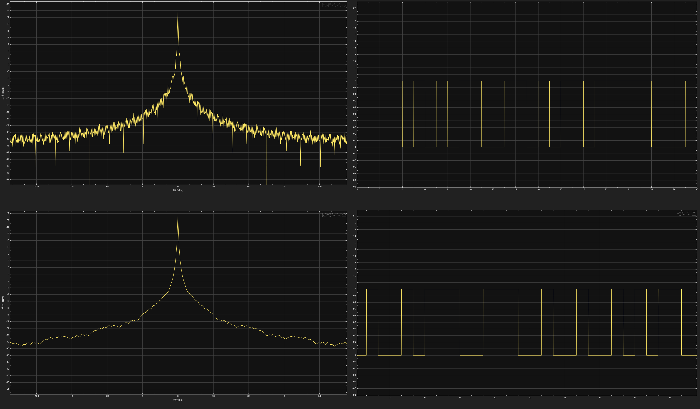
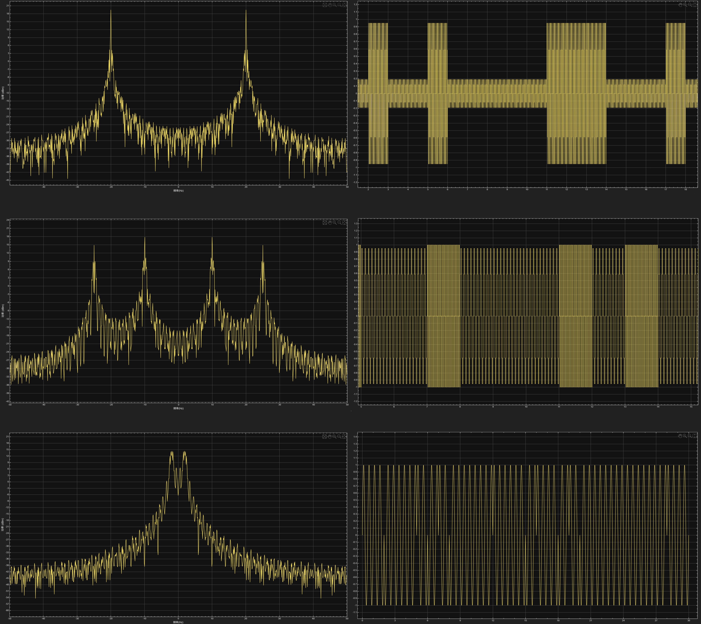
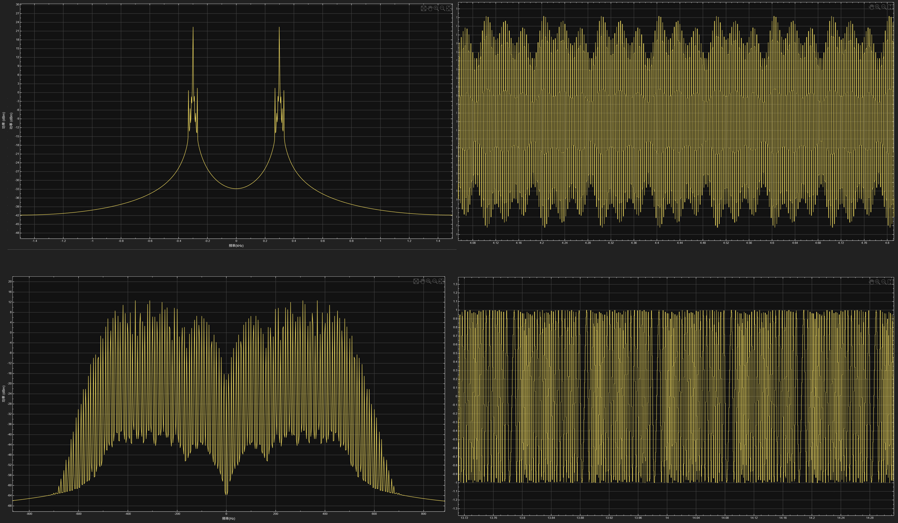
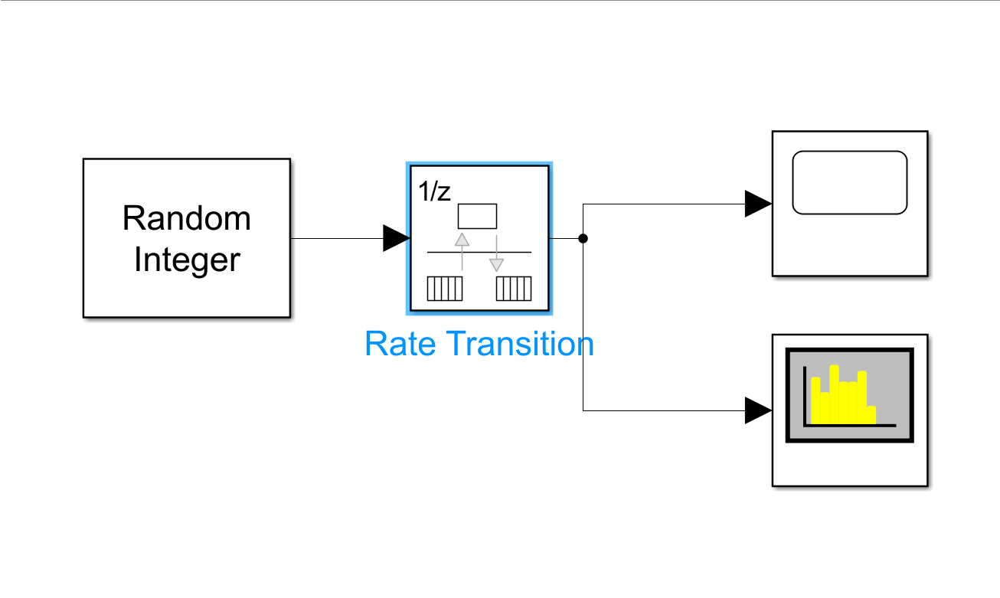
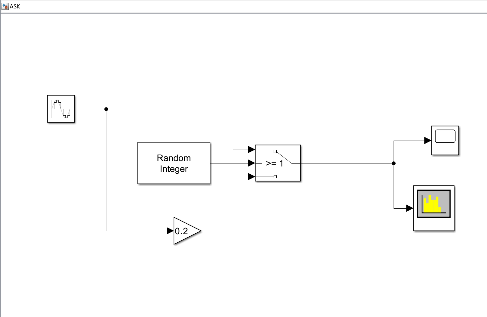
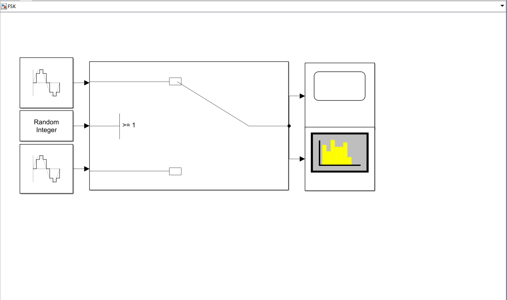
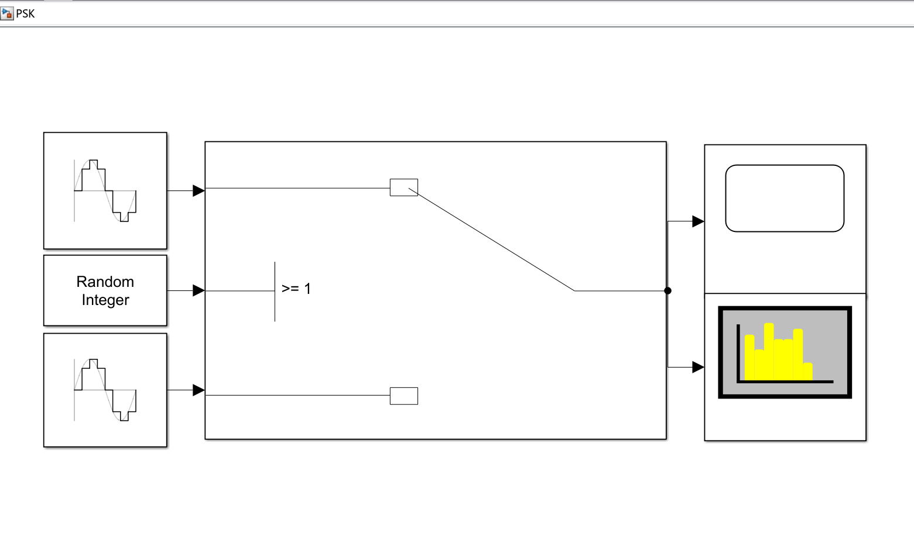
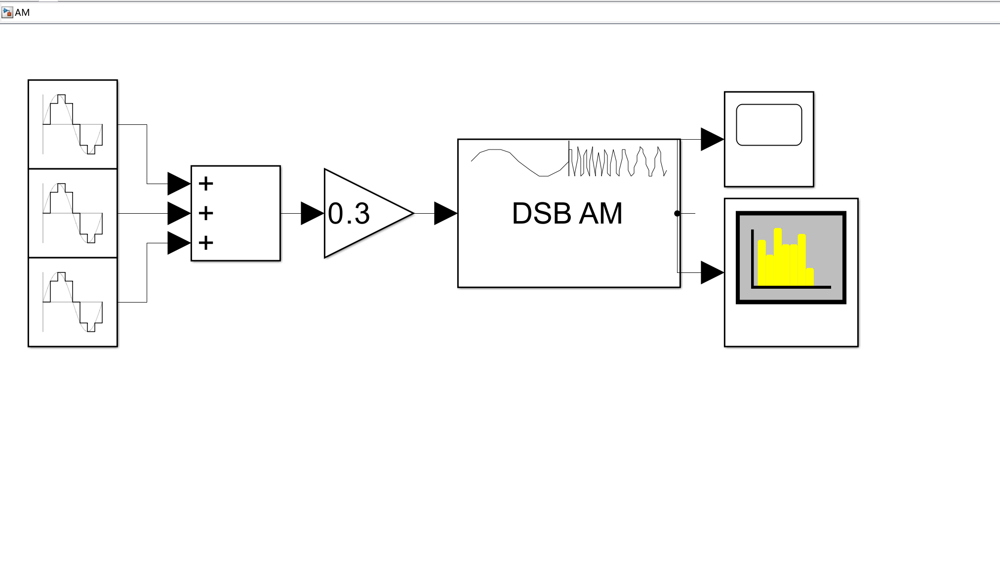
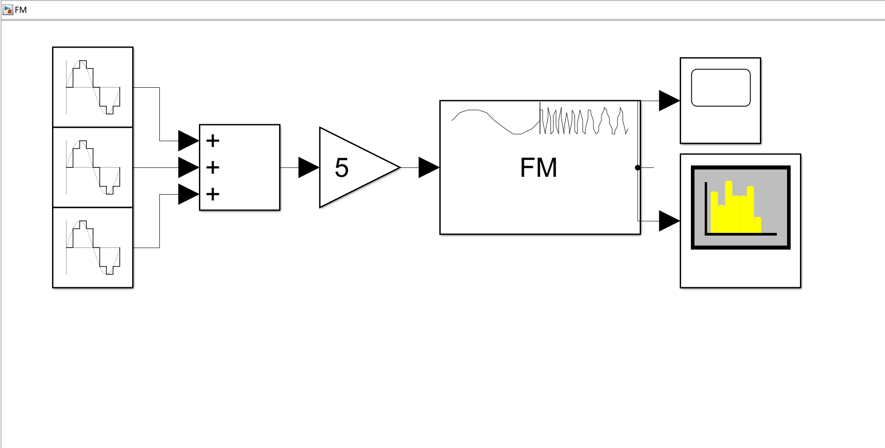

实验报告

 姓名：

 专业：

 学号：

 课程名称：
信息与电子工程导论

 任课老师：

 实验名称：
基于 Simulink 的信号调制仿真

 实验日期：
2026.3.20

# 基于 Simulink 的信号调制仿真

## 实验目的和要求

### 实验目的
1. 学习如何利用 MATLAB 中的 Simulink 模块进行信号仿真；
2. 分析信号频率、采样率对仿真结果的影响；
3. 比较数字调制各种调制方式的不同；
5. 比较模拟调制两种方法的不同.

### 实验要求

1. 熟悉在 Simulink 中不同方式的信号仿真操作；
2. 完成仿真模型搭建，成功搭建出基带信号、数字调制和模拟调制等仿真链路，输出可观测的时域和频域信号；
3. 验证参数影响：调整信号频率和采样率，对比不同参数下波形图的差异；
4. 完成调制对比的分析，分别对比数字与模拟，基带与模拟、AM 与 FM 调制的信号特征.

## 实验原理
### Simulink 仿真基础原理

​	在 Simulink 中通过模块化搭建信号链路，按照“信号源 → 处理模块 → 观测模块” 的流程实现信号仿真”：信号源模块生成基带信号或者载波信号；调制模块按照对应算法处理载波，完成信号调制；示波器和频谱分析仪分别观测信号的时域图和频谱图.

### 奈奎斯特采样定理

​	当时间信号的最高频率分量为 $f_{max}$ 时，采样的最低频率 $f_N$ 应该大于或等于 $2f_{max}$，否则采样后信号的频率就会发生重叠，高于采样频率一半的频率成分将会被重建为低于采样频率一半的信号，采样数据中会出现虚假的低频成分.

### 信号频率对结果的影响原理

​	基带信号频率决定调制信号的基带带宽，载波频率决定调制信号的中心频率，频率偏差会改变调制信号的频谱分布.

### 数字调制

​	ASK：载波的幅度按离散数字信号的变化发生跳变；
​	FSK：载波的频率按离散数字信号的变化发生跳变；
​	PSK：载波的相位按离散数字信号的变化发生跳变.

### 模拟调制

​	AM：载波的幅度连续跟随基带模拟信号变化;

​	\[ s_{\text{AM}}(t) = A_c \left [1 + k_a m(t)\right] \cos(\omega_c t + \phi_0) \]  

​	 \(A_c\)：载波幅度 
​	 \(\omega_c = 2\pi f_c\)：载波角频率 
​	\(m(t)\)：基带消息信号（均值通常为 0） 
​	\(k_a\)：幅度调制灵敏度 

​	FM：载波的频率连续跟随基带模拟信号变化.

​	\[ s_{\text{FM}}(t) = A_c \cos\left [\omega_c t + k_f \int_{-\infty}^t m(\tau) d\tau + \phi_0\right] \] 
​	\(A_c\)：载波幅度（恒定） 
​	\(\omega_c = 2\pi f_c\)：载波中心角频率 
 	\(k_f\)：频率调制灵敏度（单位：Hz/幅度单位） 
​	 \(m(t)\)：基带消息信号

## 实验内容

### 实验一：非归零码仿真

​	按照实验指导，在 Simulink 中连接各个模块，将采样频率分别设置为 200Hz、500Hz，将采样时间均设置为 30s，观察并记录信号在时域图和频谱图中的变化情况.

### 实验二：数字调制仿真

#### ASK 调制

​	添加仿真模块，将随机整数生成器设置为 0/1 输出，将正弦发生器发出的正弦波频率设置为 20Hz，增益调整为 0.2，记录 ASK 调制信号在时域图和频谱图中的特征.

#### FSK 调制

​	添加仿真模块，将两路正弦发生器发出的正弦信号频率分别设置为 10Hz 和 25Hz，保持其幅度为 1，进行仿真，记录 FSK 调制信号在时域图和频谱图中的特征.

#### PSK 调制

​	将两路正弦发生器的生成信号的幅度和频率为 1 和 2Hz，将其中一路的初始相位设置为 $\pi$，另一路初始相位设置为 0, 进行仿真，记录 PSK 调制信号在时域图和频谱图中的特征.

### 实验三：模拟调制仿真

#### AM 调幅

​	按照实验指导添加并连接各模块，三个正弦发生器发出的正弦信号合成为一个模拟信号，三个正弦信号的振幅分别设置为 0.3、0.2 和 0.5，频率分别设置为 10Hz、20Hz 和 30Hz，相位分别设置为 0，$\large \frac{\pi}{6}$ 和 $\large \frac{\pi}{3}$, 将载波频率设置为 300Hz，进行仿真，然后记录 AM 调幅信号在时域图和频谱图中的特征.

#### FM 调频

​	三个正弦信号的各项参数保持在 AM 调幅实验中的数值不变，设置载波频率为 300Hz，最大频偏为 50Hz，进行仿真，然后记录 AM 调幅信号在时域图和频谱图中的特征.

## 实验结果和分析

### 实验一：非归零码仿真

​	采样频率为 200Hz 和 100Hz 得到的信号时域图和频谱图如下：

​	观察到非归零码的时域特征为信号只呈现出 0、1 两种离散的电平值；对于其频谱，其幅值集中在低频段，幅值整体随着频率增加而渐渐衰减，频瓣的延伸范围广。这说明了非归零码对于频带的利用率比较低；对比不同采样率下的信号图像，观察到当采样频率增大时，时域图没有明显变化，但是频域图更加精确.

### 实验二：数字调制仿真

​	三种数字调制仿真得到的信号时域图和频谱图如下（从上到下依次为 ASK, FSK 和 PSK）：

​	ASK 调制仿真所得到的信号波形在时域上呈现出幅度跳变的正弦波波形，载波频率始终不变；在频域上以呈对称分布，包含载波分量和上下边带，频谱集中在载波频率附近频段；FSK 调制仿真所得到的信号波形在时域上呈现为频率跳变的正弦波波形，两路载波幅度一致，在频域上出现两个独立的载波中心频率，分别对应 0、1 码的载波频率，每整体频谱为双峰值分布，两个峰值间距等于两路载波的频率差，带宽为单路载波调制后的带宽之和；PSK 调制仿真所得到的信号波形在时域上呈现相位跳变的正弦载波波形，两路载波频率、幅度完全一致，在频域上与 ASK 频谱特征相似，以单一载波频率为中心呈对称分布，包含载波和上下边带，无额外峰值.

### 实验三：模拟调制仿真

​	两种模拟调制仿真得到的信号时域图和频谱图如下（从上到下依次为 AM 和 FM 调制）：

​	AM 调制仿真所得到的信号波形在时域上呈现为高频正弦波，其幅度随着模拟基带信号的幅值而连续变化，形成的包络线的形状与基带信号的形状相似，在频域上，以载波频率为中心呈现对称分布，信号总带宽为基带信号的最高频率的两倍；PM 调制仿真所得到的信号波形在时域上呈现为幅度保持恒定的正弦波，其瞬时频率随模拟基带信号的幅值而连续变化，相位也随着频率变化而发生变化，整体信号为幅值不变，疏密变化的正弦波，在频域上，以载波为中心呈对称分布，带宽远大于 AM 调制信号，频谱的覆盖范围更广.

## 实验结论
1. 非归零码时域呈现 0/1 离散恒定电平的矩形脉冲波形，无归零过程，频带利用率低，仅适用于短距离基带传输；采样率提升会使频域频谱更精确；
2. 数字调制是载波的幅度、频率、相位随离散基带信号发生跳变，通过频谱搬移实现基带信号远距离传输；ASK 时域为幅度跳变的正弦载波，频域单中心频率分布；FSK 时域为频率跳变的正弦载波，频域双峰值分布；PSK 时域为相位跳变的正弦载波，频域与 ASK 相似，频带利用率高；
3. 模拟调制是载波参数随连续模拟基带信号连续变化，AM 为线性调制，时域载波幅度随基带信号形成包络，带宽为 2 倍基带最高频率；FM 为非线性调制，时域载波幅度恒定、频率随基带信号疏密变化，带宽远大于 AM；
4. 信号频率决定调制信号的带宽和频谱中心位置.

## 源代码与分析
### 实验一：

>随机整数生成器生成 0/1 信号模拟数字信号，通过 Rate Transition 模块进行数据传递和数据采样.

### 实验二：

>正弦发生器生成的正弦波一路记过增益模块后振幅变为之前的 0.2，两路正弦波作为信号调制的载波，随机整数生成器生成数字基带信号.

>两个正弦发生器模块分别产生频率不同的高频正弦载波，随机整数生成器生成 0/1 随机二进制序列，作为要传输的数字基带信号，开关模块根据基带信号值切换输出：输入为 “1” 时接通高频载波，输入为 “0” 时接通低频载波.
>

>两个正弦发生器模块分别产生相位不同的高频正弦载波，随机整数生成器生成 0/1 随机二进制序列，作为要传输的数字基带信号，开关模块根据基带信号值切换输出：输入为 “1” 时接通高频载波，输入为 “0” 时接通低频载波.

### 模拟调制

>三个正弦发生器模块分别产生不同的正弦信号，经过合并之后作为待调制的信息源，DSB AM 模块将缩放后的基带信号与高频载波相乘，生成调制信号.

>三个正弦发生器模块分别产生不同的正弦信号，经过合并之后作为待调制的信息源，DSB FM 模块将缩放后的基带信号与高频载波相乘，生成调制信号.