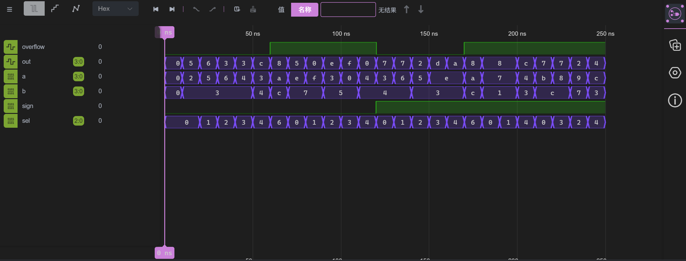

# LAB 2: Design an Alu

## Goal

  1. To learn   how  to  use  the  behavior   model  Verilog  HDL  description  to design and  implement  an ALU.

## Source Code

### Module design

#### Mux2_4bit

```verilog
module Mux2_4bit (
    input wire [3:0] a,
    input wire [3:0] b,
    input wire sel,
    output wire [3:0] out
);
    assign out = sel ? b : a;
endmodule
```


#### Mux4_4bit

```verilog
module Mux4_4bit (
    input wire [3:0] a,
    input wire [3:0] b,
    input wire [3:0] c,
    input wire [3:0] d,
    input wire [1:0] sel,
    output reg [3:0] out
);
    always @(*) begin
        case (sel)
            2'b00: out = a;
            2'b01: out = b;
            2'b10: out = c;
            2'b11: out = d;
            default: out = 4'b0000;
        endcase
    end
endmodule
```


#### Adder_Subtracter_4bit

```verilog
module Adder_Subtracter_1bit (
    input wire a,
    input wire b,
    input wire sel,
    input wire cin,
    output wire sum,
    output wire cout
);
    wire b_xor_sel;
    assign b_xor_sel = b ^ sel;
    assign sum = a ^ b_xor_sel ^ cin;
    assign cout = (a & b_xor_sel) | (cin & (a ^ b_xor_sel));
endmodule

module Adder_Subtracter_4bit (
    input wire [3:0] a,
    input wire [3:0] b,
    input wire sel,
    output wire [3:0] sum,
    output wire overflow_signed,
    output wire overflow_unsigned
);
    wire carry1, carry2, carry3, carry4;
    wire s1, s2, s3;
    Adder_Subtracter_1bit adder_subtractor0 (
        .a(a[0]),
        .b(b[0]),
        .sel(sel),
        .cin(sel),
        .sum(sum[0]),
        .cout(carry1)
    );
    Adder_Subtracter_1bit adder_subtractor1 (
        .a(a[1]),
        .b(b[1]),
        .sel(sel),
        .cin(carry1),
        .sum(sum[1]),
        .cout(carry2)
    );
    Adder_Subtracter_1bit adder_subtractor2 (
        .a(a[2]),
        .b(b[2]),
        .sel(sel),
        .cin(carry2),
        .sum(sum[2]),
        .cout(carry3)
    );
    Adder_Subtracter_1bit adder_subtractor3 (
        .a(a[3]),
        .b(b[3]),
        .sel(sel),
        .cin(carry3),
        .sum(sum[3]),
        .cout(carry4)
    );
    xor (overflow_unsigned, carry4, sel);
    xor (overflow_signed, carry3, carry4);
endmodule 
```


#### Multiplier

```verilog
module Multiplier_unsigned(
    input wire [3:0] a,
    input wire [3:0] b,
    output wire [3:0] product,
    output wire overflow_unsigned
);
    wire [7:0] temp1, temp2, temp3, temp4;
    wire [7:0] temp_product;
    wire [7:0] a_whole;
    assign a_whole = {4'b0, a};
    assign temp1 = a_whole & {8{b[0]}};
    assign temp2 = a_whole & {8{b[1]}};
    assign temp3 = a_whole & {8{b[2]}};
    assign temp4 = a_whole & {8{b[3]}};
    assign temp_product = temp1 + (temp2 << 1) + (temp3 << 2) + (temp4 << 3);
    assign product = temp_product[3:0];
    assign overflow_unsigned = | temp_product[7:4];
endmodule

module Multiplier_signed (
    input wire [3:0] a,
    input wire [3:0] b,
    output wire [3:0] product,
    output wire overflow_signed
);
    wire [3:0] abs_a, abs_b;
    wire [7:0] temp1, temp2, temp3,temp4;
    wire [7:0] temp_product_unsigned;
    wire [7:0] temp_product_signed;
    wire [7:0] a_whole, b_whole;
    assign abs_a = a[3] ? (~a + 1) : a;
    assign abs_b = b[3] ? (~b + 1) : b;
    assign a_whole = {4'b0000,abs_a};
    assign b_whole = {4'b0000,abs_b};
    assign temp1 = a_whole & {8{b_whole[0]}};
    assign temp2 = a_whole & {8{b_whole[1]}};
    assign temp3 = a_whole & {8{b_whole[2]}};
    assign temp4 = a_whole & {8{b_whole[3]}};
    assign temp_product_unsigned = temp1 + (temp2 << 1) + (temp3 << 2) + (temp4 << 3);
    assign temp_product_signed= (a[3] ^ b[3]) ? (~temp_product_unsigned[7:0] + 1) : temp_product_unsigned[7:0];
    assign product = temp_product_signed[3:0];
    assign overflow_signed = (temp_product_signed[7:4] != {4{temp_product_signed[3]}});
endmodule

module Multiplier (
    input wire [3:0] a,
    input wire [3:0] b,
    input wire sign,
    output wire [3:0] product,
    output wire overflow_signed,
    output wire overflow_unsigned
);
    wire [3:0] product_unsigned;
    wire [3:0] product_signed;
    Multiplier_unsigned multiplier_unsigned (
        .a(a),
        .b(b),
        .product(product_unsigned),
        .overflow_unsigned(overflow_unsigned)
    );
    Multiplier_signed multiplier_signed (
        .a(a),
        .b(b),
        .product(product_signed),
        .overflow_signed(overflow_signed)
    );
    assign product = sign ? product_signed : product_unsigned;
endmodule
```

```verilog
module AND (
    input wire [3:0] a,
    input wire [3:0] b,
    output wire [3:0] out
);
    and(out[0], a[0], b[0]);
    and(out[1], a[1], b[1]);
    and(out[2], a[2], b[2]);
    and(out[3], a[3], b[3]);
endmodule
```


### ALU 

```verilog
module Alu (
    input wire [3:0] a,
    input wire [3:0] b,
    input wire [2:0] sel,
    input wire sign,
    output wire [3:0] out,
    output wire overflow
);
    wire [3:0] adderinput;
    wire [3:0] adder_result;
    wire [3:0] multiplier_product;
    wire [3:0] AND_result;
    wire overflow_signed_adder, overflow_unsigned_adder;
    wire overflow_signed_multiplier, overflow_unsigned_multiplier;
    Mux2_4bit u_Mux2_4bit(
        .a   	(b    ),
        .b   	(4'b0001    ),
        .sel 	(sel[0]),
        .out 	(adderinput)
    );
    Adder_Subtracter_4bit u_Adder_Subtracter_4bit(
        .a   	(a    ),
        .b   	(adderinput),
        .sel 	(sel[1]),
        .sum 	(adder_result),
        .overflow_signed(overflow_signed_adder),
        .overflow_unsigned(overflow_unsigned_adder)
    );
    Multiplier u_Multiplier_4bit(
        .a   	(a    ),
        .b   	(b    ),
        .sign 	(sign  ),
        .product(multiplier_product),
        .overflow_signed(overflow_signed_multiplier),
        .overflow_unsigned(overflow_unsigned_multiplier)
    );
    AND u_AND (
        .a(a),
        .b(b),
        .out(AND_result)
    );
    Mux4_4bit u_Mux4_4bit(
        .a   	(adder_result ),
        .b   	(adder_result ),
        .c   	(multiplier_product),
        .d   	(AND_result),
        .sel 	(sel[2:1]),
        .out 	(out  )
    );
        Mux4_4bit u_Mux4_4bit1(
        .a   	(overflow_unsigned_adder ),
        .b   	(overflow_signed_adder ),
        .c   	(overflow_unsigned_multiplier),
        .d   	(overflow_signed_multiplier),
        .sel 	({sel[2],sign}),
        .out 	(overflow)
    );
endmodule
```


### Board_top

```verilog
module Board_top (
    input wire [3:0] switches_a,
    input wire [3:0] switches_b,
    input wire [2:0] switches_select,
    input wire switches_sign,
    output wire [3:0] led_result,
    output wire led_overflow
);
    Alu alu (
        .a(switches_a),
        .b(switches_b),
        .sel(switches_select),
        .sign(switches_sign),
        .out(led_result),
        .overflow(led_overflow)
    );
endmodule
```


### Testbench

```verilog
`timescale 1ns / 1ps
module TbAlu;
    reg [3:0] a, b;
    reg [2:0] sel;
    reg sign;
    wire [3:0] out;
    wire overflow;

    Board_top alu(
        .switches_a(a),
        .switches_b(b),
        .switches_select(sel),
        .switches_sign(sign),
        .led_result(out),
        .led_overflow(overflow)
    );

    initial begin 
        $display("========== ALU TEST ==========");
        a = 4'b0000; b = 4'b0000; sel = 3'b000; sign = 1'b0;
        #10;

        $display("\n---------- Unsigned no overflow test ----------");

        a = 4'b0010; b = 4'b0011; sel = 3'b000; sign = 1'b0; #10;
        $display("A+B  %2d + %2d = %2d  overflow=%b", a,b,out,overflow);

        a = 4'b0101; sel = 3'b001; #10;
        $display("A+1  %2d + 1  = %2d  overflow=%b", a,out,overflow);

        a = 4'b0110; b = 4'b0011; sel = 3'b010; #10;
        $display("A-B  %2d - %2d = %2d  overflow=%b", a,b,out,overflow);
  
        a = 4'b0100; sel = 3'b011; #10;
        $display("A-1  %2d - 1  = %2d  overflow=%b", a,out,overflow);

        a = 4'b0011; b = 4'b0100; sel = 3'b100; #10;
        $display("A*B  %2d * %2d = %2d  overflow=%b", a,b,out,overflow);

        a = 4'b1010; b = 4'b1100; sel = 3'b110; #10;
        $display("A & B  %b & %b = %b", a,b,out);

        $display("\n---------- Unsigned overflow test ----------");

        a = 4'b1110; b = 4'b0111; sel = 3'b000; #10;
        $display("A+B  %2d + %2d = %2d  overflow=%b", a,b,out,overflow);

        a = 4'b1111; sel = 3'b001; #10;
        $display("A+1  %2d + 1  = %2d  overflow=%b", a,out,overflow);

        a = 4'b0011; b = 4'b0101; sel = 3'b010; #10;
        $display("A-B  %2d - %2d = %2d  overflow=%b", a,b,out,overflow);

        a = 4'b0000; sel = 3'b011; #10;
        $display("A-1  %2d - 1  = %2d  overflow=%b", a,out,overflow);

        a = 4'b0100; b = 4'b0100; sel = 3'b100; #10;
        $display("A*B  %2d * %2d = %2d  overflow=%b", a,b,out,overflow);


        $display("\n---------- signed no overflow test ----------");

        a = 4'b0011; b = 4'b0100; sel = 3'b000; sign = 1'b1; #10;
        $display("A+B  %2d + %2d = %2d  overflow=%b", $signed(a),$signed(b),$signed(out),overflow);

        a = 4'b0110; sel = 3'b001; #10;
        $display("A+1  %2d + 1  = %2d  overflow=%b", $signed(a),$signed(out),overflow);

        a = 4'b0101; b = 4'b0011; sel = 3'b010; #10;
        $display("A-B  %2d - %2d = %2d  overflow=%b", $signed(a),$signed(b),$signed(out),overflow);

        a = 4'b1110; sel = 3'b011; #10;
        $display("A-1  %2d - 1  = %2d  overflow=%b", $signed(a),$signed(out),overflow);

        a = 4'b1110; b = 4'b0011; sel = 3'b100; #10;
        $display("A*B  %2d * %2d = %2d  overflow=%b", $signed(a),$signed(b),$signed(out),overflow);

        a = 4'b1010; b = 4'b1100; sel = 3'b110; #10;
        $display("A & B  %b & %b = %b", a,b,out);

        $display("\n---------- signed upper overflow test ----------");
   
        a = 4'b0111; b = 4'b0001; sel = 3'b000; #10;
        $display("A+B  %2d + %2d = %2d  overflow=%b", $signed(a),$signed(b),$signed(out),overflow);

        a = 4'b0111; sel = 3'b001; #10;
        $display("A+1  %2d + 1  = %2d  overflow=%b", $signed(a),$signed(out),overflow);

        a = 4'b0100; b = 4'b0011; sel = 3'b100; #10;
        $display("A*B  %2d * %2d = %2d  overflow=%b", $signed(a),$signed(b),$signed(out),overflow);

        $display("\n---------- signed lower overflow test ----------");

        a = 4'b1011; b = 4'b1100; sel = 3'b000; #10;
        $display("A+B  %2d + %2d = %2d  overflow=%b", $signed(a),$signed(b),$signed(out),overflow);

        a = 4'b1000; sel = 3'b011; #10;
        $display("A-1  %2d - 1  = %2d  overflow=%b", $signed(a),$signed(out),overflow);

        a = 4'b1001; b = 4'b0111; sel = 3'b010; #10;
        $display("A-B  %2d - %2d = %2d  overflow=%b", $signed(a),$signed(b),$signed(out),overflow);

        a = 4'b1100; b = 4'b0011; sel = 3'b100; #10;
        $display("A*B  %2d * %2d = %2d  overflow=%b", $signed(a),$signed(b),$signed(out),overflow);

        $display("\n========== TEST COMPLETE ==========");
        $finish;
    end
        initial begin
            $dumpfile("testbench.vcd");
            $dumpvars(0, TbAlu);
        end
endmodule
```


## Design 

​	This module implements a 4-bit Arithmetic and Logic Unit (ALU) that supports arithmetic and logical operations. It takes two 4-bit operands a and b, a 3-bit operation select signal sel, and a signed/unsigned control signal sign. It outputs a 4-bit result out and an overflow flag overflow.

​	

|   Signal   | Port type |   Bit width   |   Usage   |
| ---- | ---- | ---- | ---- |
| a | input | 4-bit | operand |
| b | input | 4-bit | operand |
| signal | input | 1-bit | toggle the sign mode |
| sel | input | 3-bit | select the function |
| out | output | 4-bit | outcome |
| overflow | output | 1-bit | check for overflow |

​	Its Function Table:

 

|   sel [2]   |   sel [2]   |  sel [2]    | Function   |
| :--: | :--: | :--: | :--: |
| 0 | 0 | 0 | A + B |
| 0 | 0 | 1 | A + 1 |
| 0 | 1 | 0 | A - B |
| 0 | 1 | 1 | A - 1 |
| 1 | 0 | X | A * B |
| 1 | 1 | X | A & B |


## Testcase descriptions

​	Test results are as follows:



```
========== ALU TEST ==========
---------- Unsigned no overflow test ----------
A+B   2 +  3 =  5  overflow=0
A+1   5 + 1  =  6  overflow=0
A-B   6 -  3 =  3  overflow=0
A-1   4 - 1  =  3  overflow=0
A*B   3 *  4 = 12  overflow=0
A & B  1010 & 1100 = 1000
---------- Unsigned overflow test ----------
A+B  14 +  7 =  5  overflow=1
A+1  15 + 1  =  0  overflow=1
A-B   3 -  5 = 14  overflow=1
A-1   0 - 1  = 15  overflow=1
A*B   4 *  4 =  0  overflow=1
---------- signed no overflow test ----------
A+B   3 +  4 =  7  overflow=0
A+1   6 + 1  =  7  overflow=0
A-B   5 -  3 =  2  overflow=0
A-1  -2 - 1  = -3  overflow=0
A*B  -2 *  3 = -6  overflow=0
A & B  1010 & 1100 = 1000
---------- signed upper overflow test ----------
A+B   7 +  1 = -8  overflow=1
A+1   7 + 1  = -8  overflow=1
A*B   4 *  3 = -4  overflow=1
---------- signed lower overflow test ----------
A+B  -5 + -4 =  7  overflow=1
A-1  -8 - 1  =  7  overflow=1
A-B  -7 -  7 =  2  overflow=1
A*B  -4 *  3 =  4  overflow=1
========== TEST COMPLETE ==========
h:/Files/Courses/Digitalsystem/Lab2/Code/user/sim/Testbench.v:107: $finish called at 250000 (1ps)
```

​	First, verify the correctness of all operations in unsigned arithmetic: test normal cases without overflow first, followed by overflow cases. Then perform tests in signed arithmetic using the same sequence: normal non-overflow cases first, then overflow cases. For signed overflow, both upper bound overflow and lower bound overflow are tested and analyzed separately.

## AI usage declaration

​	During the experiment, AI was used for verification work and Testbench sample generation. The main part of the experiment was completed independently by myself.
